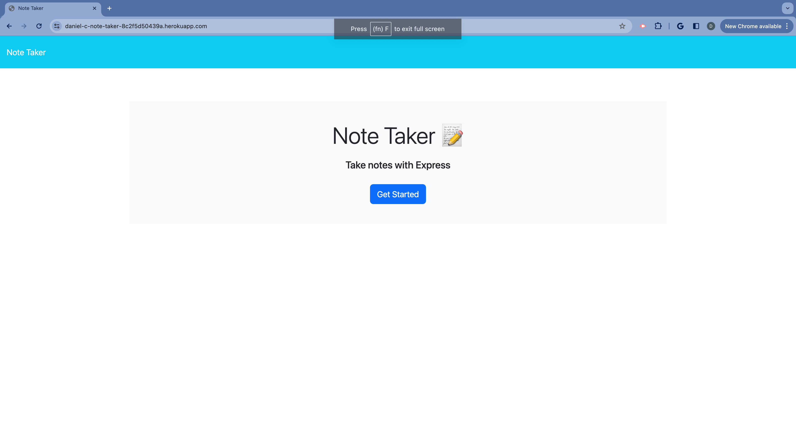
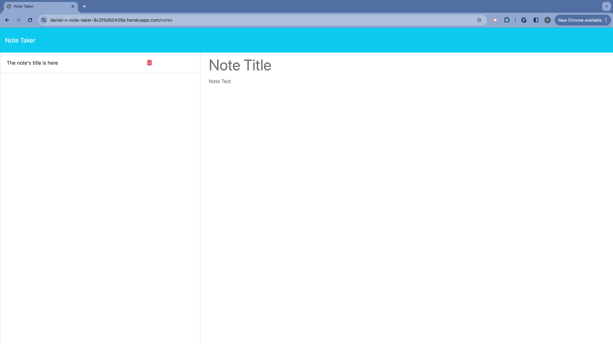
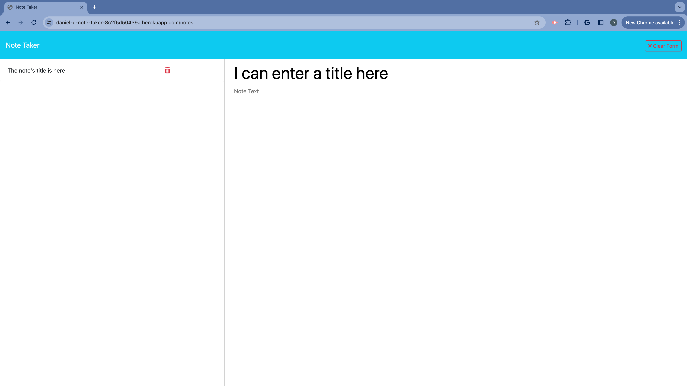
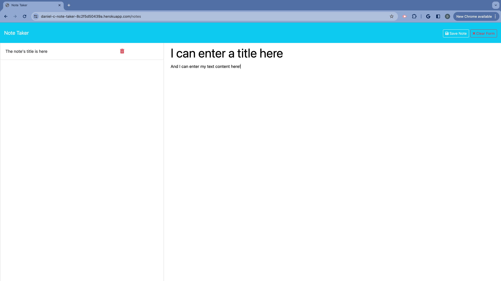
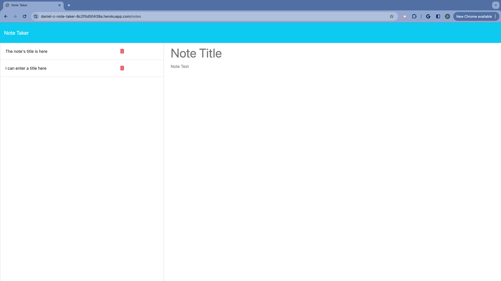
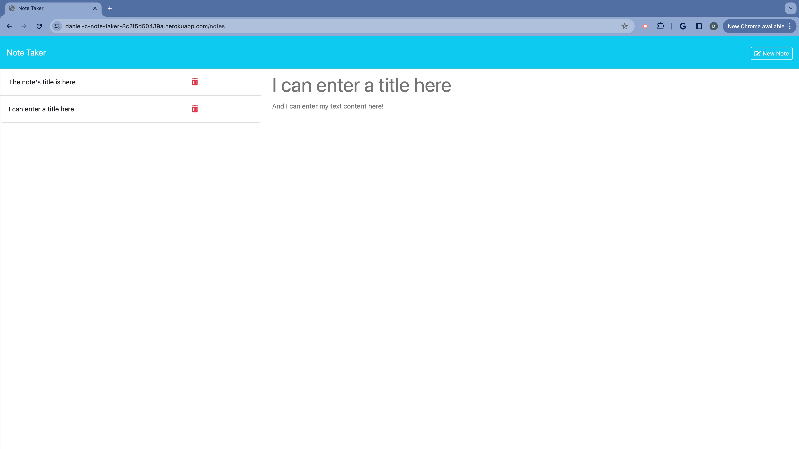

# Daniel's Note Taker

## 

## Description

This app was created so that users can write and save notes. It is simple in its purpose.

This app uses 3 key technologies for its ability to run on a server, namely Node.js, Express.js, and Heroku.

Through the development of this app, I learned/practiced the following:

- Using an Express.js back end to save and retrieve note data from a JSON file
- Deploying an app to Heroku so that my back end can be implemented, and the app can be accessed/used by anybody with the link
- Importing/exporting modules: 3rd party, custom, and built-in
- Using pre-made, boiler-plate helper modules that integrate methods from multiple modules
- Implementing middleware
- Use of routers
- Separation of concerns
- Setting up methods for client-side GET, POST, and DELETE requests
- Express.js syntax

## Table of Contents

- [Installation](#installation)
- [Usage](#usage)
- [Contributions](#contributions)
- [License](#license)

## Installation

Visit the [Heroku link](https://daniel-c-note-taker-8c2f5d50439a.herokuapp.com/) (easy way),
or [download/clone repository](https://github.com/danrcross/daniel-note-taker) and run from terminal (hard way):

1. Navigate to app directory in terminal
2. In command line, run `npm start`; console should log 'Server up on http://localhost:4040'
3. Navigate to http://localhost:4040 in browser
4. Done! App will be useable at this link!

## Usage

Landing page @ app URL:

Get-started was pressed:

A title has been entered; 'Clear Form' button appears:

Text has been entered; 'Save Note' button appears:

'Save Note pressed; note saved and appears in left-hand column:

The saved note is clicked; notes title and text appear as read-only in the right-hand column; 'New Note' button appears:

'New Note' button is pressed; note that was displayed is no longer displayed; user may enter a new note;

Note has been deleted by pressing red trashcan button next to that note:

## License

This application is covered under the [MIT](https://opensource.org/licenses/MIT) license.

## Contributions

Starter code acquired from user [coding-boot-camp](https://github.com/coding-boot-camp/miniature-eureka), @ repository titled [miniature-eureka](https://github.com/coding-boot-camp/miniature-eureka)

Thanks to contributing users: [Xandromus](https://github.com/Xandromus), [nol166](https://github.com/nol166), and [Georgeyoo](https://github.com/Georgeyoo)

Helper file [fsUtils.js](./helpers/fsUtils.js) retrieved from in-class activity #22, from Module 11.

[Notes file](./routes/notes.js) takes influence from the tips.js file found also in activity #22, from Module 11.

## Tests

No tests used

## Questions

Any Questions? Click a link below to visit my GitHub and/or email me!

For emails, please use this format in the subject line: 'GitHub: {NAME_OF_REPOSITORY}'

[GitHub](https://github.com/danrcross)

[Email](mailto:danrcross@gmail.com)
